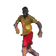

## Wsg

  

Second-year student studying Math and Computer Science at McMaster University 

📂 featured stuff
- 🔹 **LookFirst** —  Computer vision–based driver training system to evaluate observational awareness
before on-road instruction.
- 🔹 **Two-Class & Multi-Class Classification** —  basic classification methods and how they extend from binary (two-class) problems to multi-class settings.

### 📫 reach me
- 
- <a href="https://rashawngr20.github.io/rashawn.github.io/">  check my site </a>

<!--
**RashawnGr20/rashawngr20** is a ✨ _special_ ✨ repository because its `README.md` (this file) appears on your GitHub profile.

Here are some ideas to get you started:

- 🔭 I’m currently working on ...
- 🌱 I’m currently learning ...
- 👯 I’m looking to collaborate on ...
- 🤔 I’m looking for help with ...
- 💬 Ask me about ...
- 📫 How to reach me: ...
- 😄 Pronouns: ...
- ⚡ Fun fact: ...
-->
